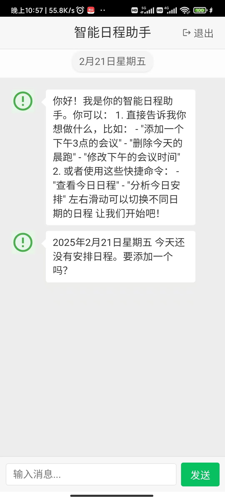

# 智能日程助手 🗓️

一个基于 AI 的智能日程管理工具，帮助你更高效地规划和管理时间。

## ✨ 主要特点

### 🤖 智能日程规划
- 通过简单的登录即可开始使用
- 智能分析任务优先级和时间分配
- 根据个人习惯和偏好进行个性化推荐
- 实时调整计划，灵活应对突发状况

## 📱 移动端下载

## 💡 使用场景

### 个人用户
- 日常工作安排
- 学习计划制定
- 生活事务管理
- 约会提醒

### 企业用户
- 团队会议安排
- 项目进度管理
- 任务分配追踪
- 团队协作

## 💼 商务合作

📞 商务联系：
- 商务邮箱：leng_ff@163.com

## 🎁 支持我们与反馈

如果您觉得这个项目对您有帮助，欢迎给予支持！

- 微信打赏
  

- 邮箱：leng_ff@163.com
- 问题反馈：[提交 Issue](https://github.com/lengff123/AI-schedule-assistant/issues)
- 功能建议：[提交建议](https://github.com/lengff123/AI-schedule-assistant/discussions)
